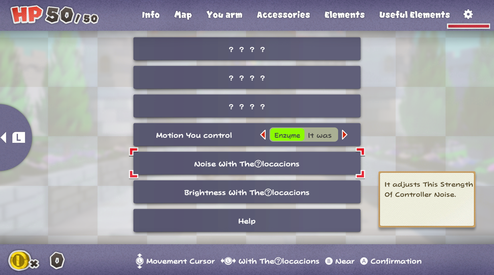

# MSBTranslator

An automatic "bad translator" for Switch Game MSBT Files with a focus on high compatibility.

## What does it do?

MSBTranslator is a Switch modding tool intended to automate the creation of "badly translated" mods. For anyone unfamiliar: "Badly translated games" are mods that take all text in a game's files and runs them through multiple automated translations, making the result a garbled mess of words that only somewhat represent the original text. Why? Because it's funny.

## How do I use it?

In order to get the program started you need to extract `.msbt` files from the game. (If you don't know how to do that yet you're probably in the wrong place.) Once that's done you can simply drag-and-drop the file onto the executable of MSBTranslator and it will start to automatically badly translate every bit of text it finds in the file. As soon as the translation process is done it overwrites the selected file with the badly translated one, so make sure to keep a backup if you don't want to lose the original files!

## How does it work?

The program reads the MSBT file using the MSBT interface from the [Kuriimu Suite](https://github.com/IcySon55/Kuriimu) (which is why the repository contains the GPL-3.0 License) and uses the free Apertium API for translation (via the [Apertium.Net Package](https://github.com/vonderborch/Apertium.Net)). Translations are done for each word individually (both to preserve special characters that influence how the text is displayed in the game as well as to make the results even more senseless) and through a series of languages (which should eventually be user-configurable). Due to the Apertium API being free this process takes quite a lot of time, so expect a good amount of waiting before all lines are properly processed.

## Credits

- [IcySon55](https://github.com/IcySon55) for the creation of [Kuriimu](https://github.com/IcySon55/Kuriimu) (parts of which were used in this project)
- [vonderborch](https://github.com/vonderborch) for the creation of the wonderfully easy to use [Apertium.Net Package](https://github.com/vonderborch/Apertium.Net)
- [Apertium](https://apertium.org/) for providing one of the few free and unlimited translation services out there

## Screenshots

